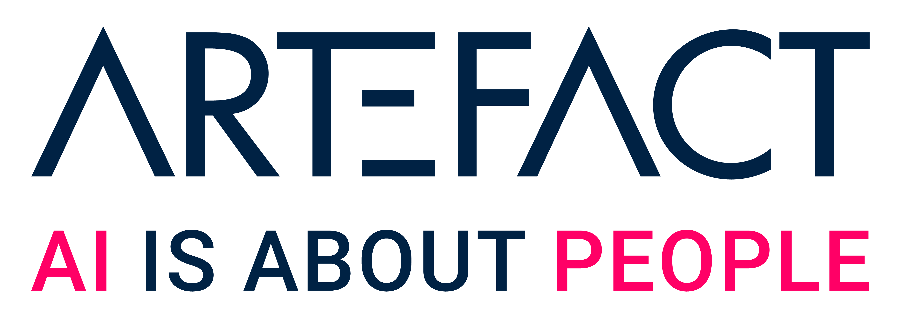

<div align="center">


*Large-scale choice modeling through the lens of machine learning*

[](https://github.com/artefactory/choice-learn/actions/workflows/ci.yaml?query=branch%3Amain)
[](https://github.com/astral-sh/ruff)
[](https://github.com/PyCQA/bandit)
[](https://github.com/artefactory/choice-learn/blob/main/.pre-commit-config.yaml)


[]()


</div>


Choice-Learn is a Python package designed to help you formulate, estimate, and deploy discrete choice models, e.g., for assortment planning.
The package provides ready-to-use datasets and models studied in the academic literature. It also provides a lower level use if you wish to customize the specification of the choice model or formulate your own model from scratch. Choice-Learn efficiently handles large-scale choice data by limiting RAM usage.

Choice-Learn uses NumPy and pandas as data backend engines and TensorFlow for models.

## :trident: Table of Contents
  - [Introduction - Discrete Choice Modelling](#introduction---discrete-choice-modelling)
  - [What's in there ?](#whats-in-there-)
  - [Getting Started](#getting-started)
  - [Installation](#installation)
  - [Usage](#usage)
  - [Documentation](#documentation)
  - [Contributing](#contributing)
  - [Citation](#citation)

## :trident: Introduction - Discrete Choice Modelling

Discrete choice models aim at explaining or predicting choices over a set of alternatives. Well known use-cases include analyzing people's choice of mean of transport or products purchases in stores.

If you are new to choice modelling, you can check this [resource](https://www.publichealth.columbia.edu/research/population-health-methods/discrete-choice-model-and-analysis). The different notebooks from the [Getting Started](#getting-started---fast-track) section can also help you understand choice modelling and more importantly help you for your usecase.

## :trident: What's in there ?

### Data
- Generic dataset handling with the ChoiceDataset class [[Example]](notebooks/introduction/2_data_handling.ipynb)
- Ready-To-Use datasets:
  - [SwissMetro](./choice_learn/datasets/data/swissmetro.csv.gz) [[2]](#citation)
  - [ModeCanada](./choice_learn/datasets/data/ModeCanada.csv.gz) [[3]](#citation)
  - The [Train](./choice_learn/datasets/data/train_data.csv.gz) dataset [[5]](#citation)
  - The [Heating](./choice_learn/datasets/data/heating_data.csv.gz), [HC](./choice_learn/datasets/data/HC.csv.gz) & [Electricity](./choice_learn/datasets/data/electricity.csv.gz) datasets from Kenneth Train described [here](https://rdrr.io/cran/mlogit/man/Electricity.html), [here](https://cran.r-project.org/web/packages/mlogit/vignettes/e2nlogit.html) and [here](https://rdrr.io/cran/mlogit/man/Heating.html)
  - [Stated car preferences](./choice_learn/datasets/data/car.csv.gz) [[9]](#citation)
  - The [TaFeng](./choice_learn/datasets/data/ta_feng.csv.zip) dataset from [Kaggle](https://www.kaggle.com/datasets/chiranjivdas09/ta-feng-grocery-dataset)
  - The ICDM-2013 [Expedia](./choice_learn/datasets/expedia.py) dataset from [Kaggle](https://www.kaggle.com/c/expedia-personalized-sort) [[6]](#citation)

### Model estimation
- Ready-to-use models:
  - Conditional MultiNomialLogit [[4]](#citation)[[Example]](notebooks/introduction/3_model_clogit.ipynb)
  - Nested Logit [[10]](#citation) [[Example]](notebooks/models/nested_logit.ipynb)
  - Latent Class MultiNomialLogit [[Example]](notebooks/models/latent_class_model.ipynb)
  - RUMnet [[1]](#citation)[[Example]](notebooks/models/rumnet.ipynb)
  - TasteNet [[7]](#citation)[[Example]](notebooks/models/tastenet.ipynb)
- Custom modelling is made easy by subclassing the ChoiceModel class [[Example]](notebooks/introduction/4_model_customization.ipynb)

### Auxiliary tools
- Assortment & Pricing optimization algorithms [[Example]](notebooks/auxiliary_tools/assortment_example.ipynb) [[8]](#citation)

## :trident: Getting Started

You can find the following tutorials to help you getting started with the package:
- Generic and simple introduction [[notebook]](notebooks/introduction/1_introductive_example.ipynb)[[doc]](https://expert-dollop-1wemk8l.pages.github.io/notebooks/introduction/1_introductive_example/)
- Detailed explanations of data handling depending on the data format [[noteboook]](notebooks/introduction/2_data_handling.ipynb)[[doc]](https://expert-dollop-1wemk8l.pages.github.io/notebooks/introduction/2_data_handling/)
- A detailed example of conditional logit estimation [[notebook]](notebooks/introduction/3_model_clogit.ipynb)[[doc]](https://expert-dollop-1wemk8l.pages.github.io/notebooks/introduction/3_model_clogit/)
- Introduction to custom modelling and more complex parametrization [[notebook]](notebooks/introduction/4_model_customization.ipynb)[[doc]](https://expert-dollop-1wemk8l.pages.github.io/notebooks/introduction/4_model_customization/)

## :trident: Installation

### User installation

To install the required packages in a virtual environment, run the following command:

The easiest is to pip-install the package:
```bash
pip install choice-learn
```

Otherwise you can use the git repository to get the latest version:
```bash
git clone git@github.com:artefactory/choice-learn.git
```

### Dependencies
For manual installation, Choice-Learn requires the following:
- Python (>=3.9)
- NumPy (>=1.24)
- pandas (>=1.5)

For modelling you need:
- TensorFlow (>=2.13)

> :warning: **Warning:** If you are a MAC user with a M1 or M2 chip, importing TensorFlow might lead to Python crashing.
> In such case, use anaconda to install TensorFlow with `conda install -c apple tensorflow`.

An optional requirement used for coefficients analysis and L-BFGS optimization is:
- TensorFlow Probability (>=0.20.1)

Finally for pricing or assortment optimization, you need either Gurobi or OR-Tools:
- gurobipy (>=11.0.0)
- ortools (>=9.6.2534)

<p align="center">
  <a href="https://numpy.org/">
    
  </a>
  &nbsp;
  &nbsp;
  <a href="https://pandas.pydata.org/">
    
  </a>
  &nbsp;
  &nbsp;
  <a href="https://www.tensorflow.org">
    
  </a>
  &nbsp;
  &nbsp;
  <a href="https://www.gurobi.com/">
    
  </a>
  &nbsp;
  &nbsp;
  <a href="https://developers.google.com/optimization?hl=fr">
    
  </a>
</p>

> :bulb: **Tip:** You can use the poetry.lock or requirements-complete.txt files with poetry or pip to install a fully predetermined and working environment.

## :trident: Usage
Here is a short example of model parametrization to estimate a Conditional Logit on the SwissMetro dataset.

```python
from choice_learn.data import ChoiceDataset
from choice_learn.models import ConditionalLogit, RUMnet

# Instantiation of a ChoiceDataset from a pandas.DataFrame
# Only need to specify how the file is encoded:
dataset = ChoiceDataset.from_single_long_df(df=transport_df,
                                            items_id_column="alt",
                                            choices_id_column="case",
                                            choices_column="choice",
                                            shared_features_columns=["income"],
                                            items_features_columns=["cost", "freq", "ovt", "ivt"],
                                            choice_format="item_id")

# Initialization of the model
model = ConditionalLogit()

# Creation of the different weights:

# add_coefficients adds one coefficient for each specified item_index
# intercept, and income are added for each item except the first one that needs to be zeroed
model.add_coefficients(feature_name="intercept",
                       items_indexes=[1, 2, 3])
model.add_coefficients(feature_name="income",
                       items_indexes=[1, 2, 3])
model.add_coefficients(feature_name="ivt",
                       items_indexes=[0, 1, 2, 3])

# shared_coefficient add one coefficient that is used for all items specified in the items_indexes:
# Here, cost, freq and ovt coefficients are shared between all items
model.add_shared_coefficient(feature_name="cost",
                             items_indexes=[0, 1, 2, 3])
model.add_shared_coefficient(feature_name="freq",
                             items_indexes=[0, 1, 2, 3])
model.add_shared_coefficient(feature_name="ovt",
                             items_indexes=[0, 1, 2, 3])

history = model.fit(dataset, get_report=True)
print("The average neg-loglikelihood is:", model.evaluate(dataset).numpy())
print(model.report)
```

## :trident: Documentation

A detailed documentation of this project is available [here](https://artefactory.github.io/choice-learn/).\
TensorFlow also has extensive [documentation](https://www.tensorflow.org/) that can help you.

## :trident: Contributing
You are welcome to contribute to the project ! You can help in various ways:
- raise issues
- resolve issues already opened
- develop new features
- provide additional examples of use
- fix typos, improve code quality
- develop new tests

We recommend to first open an [issue](https://github.com/artefactory/choice-learn/issues) to discuss your ideas. More details are given [here](./CONTRIBUTING.md).

## :trident: Citation

If you consider this package and any of its feature useful for your research, please cite us.

### License

The use of this software is under the MIT license, with no limitation of usage, including for commercial applications.

### Authors

### Special Thanks

### Affiliations

Choice-Learn has been developed through a collaboration between researchers at the Artefact Research Center and the laboratory MICS from CentraleSupélec, Université Paris Saclay.

<p align="center">
  <a href="https://www.artefact.com/data-consulting-transformation/artefact-research-center/">
    
  </a>
  &emsp;
  &emsp;
  <a href="https://www.artefact.com/">
    
  </a>
</p>

<p align="center">
  <a href="https://www.universite-paris-saclay.fr/">
    
  </a>
  &emsp;
  &emsp;
  <a href="https://mics.centralesupelec.fr/">
    
  </a>
  &emsp;
  &emsp;
  <a href="https://www.london.edu/">
    
  </a>
  &emsp;
  &emsp;
  <a href="https://www.insead.edu/">
    
  </a>
</p>

## :trident: References

### Papers
[1][Representing Random Utility Choice Models with Neural Networks](https://arxiv.org/abs/2207.12877), Aouad, A.; Désir, A. (2022)\
[2][The Acceptance of Model Innovation: The Case of Swissmetro](https://www.researchgate.net/publication/37456549_The_acceptance_of_modal_innovation_The_case_of_Swissmetro), Bierlaire, M.; Axhausen, K., W.; Abay, G. (2001)\
[3][Applications and Interpretation of Nested Logit Models of Intercity Mode Choice](https://trid.trb.org/view/385097), Forinash, C., V.; Koppelman, F., S. (1993)\
[4][The Demand for Local Telephone Service: A Fully Discrete Model of Residential Calling Patterns and Service Choices](https://www.jstor.org/stable/2555538), Train K., E.; McFadden, D., L.; Moshe, B. (1987)\
[5] [Estimation of Travel Choice Models with Randomly Distributed Values of Time](https://ideas.repec.org/p/fth/lavaen/9303.html), Ben-Akiva, M.; Bolduc, D.; Bradley, M. (1993)\
[6] [Personalize Expedia Hotel Searches - ICDM 2013](https://www.kaggle.com/c/expedia-personalized-sort), Ben Hamner, A.; Friedman, D.; SSA_Expedia. (2013)\
[7] [A Neural-embedded Discrete Choice Model: Learning Taste Representation with Strengthened Interpretability](https://arxiv.org/abs/2002.00922), Han, Y.; Calara Oereuran F.; Ben-Akiva, M.; Zegras, C. (2020)\
[8] [A branch-and-cut algorithm for the latent-class logit assortment problem](https://www.sciencedirect.com/science/article/pii/S0166218X12001072), Méndez-Díaz, I.; Miranda-Bront, J. J.; Vulcano, G.; Zabala, P. (2014)\
[9] [Stated Preferences for Car Choice in Mixed MNL models for discrete response.](https://www.jstor.org/stable/2678603), McFadden, D. and Kenneth Train (2000)\
[10] [Modeling the Choice of Residential Location](https://onlinepubs.trb.org/Onlinepubs/trr/1978/673/673-012.pdf), McFadden, D. (1978)

### Code and Repositories

*Official models implementations:*

[1] [RUMnet](https://github.com/antoinedesir/rumnet)\
[7] TasteNet [[Repo1](https://github.com/YafeiHan-MIT/TasteNet-MNL)] [[Repo2](https://github.com/deborahmit/TasteNet-MNL)]

*Other choice modeling packages:*

- [PyLogit](https://github.com/timothyb0912/pylogit)
- [Torch Choice](https://gsbdbi.github.io/torch-choice)
- [BioGeme](https://github.com/michelbierlaire/biogeme)
- [mlogit](https://github.com/cran/mlogit)
