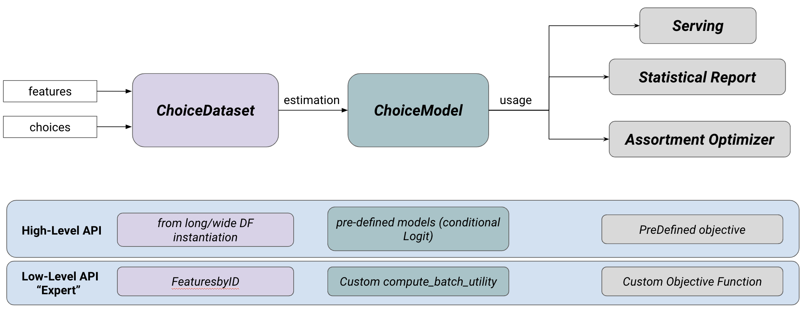

# Introduction

Discrete choice models aim at predicting choice decisions made by individuals from a menu of alternatives, which is known as an assortment. Well-known use cases include predicting a commuter's choice of transportation mode or a customer's in-store or online purchases. A key capability of choice models is their ability to handle assortment variations, such as predicting choices when some alternatives become unavailable or when their features change in different operational contexts. This adaptability to different scenarios allows these models to be used as inputs for optimization problems, such as assortment planning or pricing.

Choice-Learn provides a modular suite of choice modeling tools for practitioners and academic researchers to process choice data, and then formulate, estimate and operationalize choice models. The library is structured into two levels of usage, as illustrated in Figure \ref{fig:gen_org}. The higher-level is designed for fast and easy implementation and the lower-level enables more advanced customization. This structure is inspired by Keras [@Chollet:2015], which is an overlay of TensorFlow [@Abadi:2015] endpoints, enabling a user-friendly modeling interface. Choice-Learn was designed with the following objectives:

- **Streamlined:** The code signature is kept simple for fast integration of datasets and estimation of standard models. The higher-level API can be used with minimal code.
- **Scalable:** Optimized processes are implemented, allowing the use of large datasets and large models.
- **Flexible:** The codebase is designed to be customized in order to fit different use cases. The lower-level API offers more control over the possible parameterizations.
- **Models Library:** The same package provides implementations of both standard choice models and machine learning-based methods, including neural networks.
- **Downstream operations:** Post-processing tools  that leverage choice models for assortment optimization and pricing are also integrated into the library.



A summary of the main contributions of Choice-Learn is provided in Table \ref{tab:comparison}.

+--------------+-------------+-----------+----------------+-----------+----------------+-------------+-----------+--------+----------+-------------+
| Package      | Data Processing         | Estimation                                  | Models                           | Downstream Operations  |
+:============:+:===========:+:=========:+:==============:+:=========:+:==============:+:===========:+:=========:+:======:+:==========:+:=========:+
|              | Format      | Batching  | Non-stochastic | Stochstic | Regularization | Traditional | NeuralNet | Custom | Assortment | Pricing   |
+--------------+-------------+-----------+----------------+-----------+----------------+-------------+-----------+--------+------------+-----------+
| Biogeme      | cells span columns      | cells span columns                          | cells span columns      | cells span columns  | columns   |
+--------------+-------------+-----------+-------------+--------------+----------------+-------------+-----------+--------+------------+-----------+
| PyLogit      | cells span columns      | cells span columns                          | cells span columns      | cells span columns  | columns   |
+--------------+-------------+-----------+-------------+--------------+----------------+-------------+-----------+--------+------------+-----------+
| Torch-Choice | cells span columns      | cells       | - body                        | cells span columns      | cells span columns  | columns   |
+--------------+-------------+-----------+-------------+--------------+----------------+-------------+-----------+--------+------------+-----------+
| Choice-Learn | cells span columns      |             | - here                        | cells span columns      | cells span columns  | columns   |
+==============+============+============+============+===============+================+============+============+========+==========+=============+


# Statement of need

## Streamlined signatures
`Choice-Learn` proposes short signatures for a fast implementation. For example, the *ChoiceDataset* object, which handles the dataset, takes only 4 inputs: 'items_features' describing each available alternative, 'shared_features' describing the context of the choice, 'available_items' indicating the subset of alternatives offered in the assortment, and finally 'choices', the index of the chosen option. Choice-Learn also provides methods to seamlessly integrate popular data formats, such as long and wide format dataframes [@Helveston:2023].

```python
dataset = ChoiceDataset(choices, shared_features, items_features, available_items)
```

The signatures for data usage in model estimation and evaluation are designed to be consistent with mainstream machine learning packages such as scikit-learn [@Pedregosa:2011].

## Data and model scalability

Choice modeling is a standard tool for brick-and-mortar retailers and online marketplaces to better understand customer behavior and optimize product offerings. With the continuous development of firms' data architectures, larger-scale and more reliable choice datasets are leveraged to manage customer-facing operations.

`Choice-Learn`'s data structure relies on NumPy [@Harris:2020] with the objective of limiting the memory footprint. It minimizes the repetition of the same item or customer features and defers the instantiation of the full data structure until processing batches of data. Moreover, the *FeaturesStorage* object allows feature values to be referenced in the dataset only by their ID. These features value are  substituted to the ID placeholder on the fly in the batching process. For instance, suppose that we have access to store features such as surface, position, or number of employees. These features are often stationary: they do not change over time when predicting customer choices. Thus, they can be stored in an auxiliary data structure and it suffices to reference in the main dataset in which specific store the choice observation is recorded. Figure \ref{fig:fbi} illustrates this approach.

The package stands on Tensorflow [@Abadi:2015] for model estimation, offering the possibility to use fast second-order optimization algorithm such as L-BFGS [@Nocedal:2006] as well as various gradient-descent optimizers [@Tieleman:2012; @Kingma:2017] specialized in handling batches of data. GPU usage is also possible, which can prove to be time-saving.
Finally, the TensorFlow backbone ensures an efficient usage in a production environment, such as within an assortment recommendation software. Many state-of-the-art tools are provided for deployment and serving, such as TFLite and TFServing.


## Flexible usage: from linear utility to customized specification

Choice models following the *Random Utility Maximization* principle [@McFadden:2000] define the utility of an option $i \in \mathcal{A}$ as the sum of a deterministic part $U(i)$ and an error random term $\epsilon_i$. If the noise terms $(\epsilon_i)_{i \in \mathcal{A}}$ are assumed to be independent and Gumbel-distributed, the probability to choose option $i$ can be written as the softmax normalization over the available alternatives $j\in \mathcal{A}$:

$$\mathbb{P}(i|\mathcal{A}) = \frac{e^{U(i)}}{\sum_{j \in \mathcal{A}} e^{U(j)}}$$

The choice-modeller's job is to formulate an appropriate utility function depending on the context. In Choice-Learn, the user can parametrize predefined models such as the Conditional Logit or freely specify a custom utility function by overriding the *compute_batch_utility* method from the *ChoiceModel* class. This allows for tailoring choice models to different use cases.

## Unifying  traditional random utility models and machine learning-based models

Traditional parametric choice models often specify the utility function as a linear form. While this provides interpretable coefficients, such as price  elasticities, it also limits the predictive power of the model.
The availability of detailed customer choice data, paired with advances in machine learning, enables the estimation of more complex models. Recent research outlines this potential with neural networks approaches [@Han:2022; @Aouad:2023] and tree-based models [@Salvadé:2024; @AouadMarket:2023]. However, existing choice libraries [@Bierlaire:2023; @Brathwaite:2018; @Du:2023] are often not designed to integrate such machine learning-based approaches.

Choice-Learn proposes a unified estimation tool based on  TensorFlow's automatic differentiation [@Abadi:2015], which can flexibly accommodate traditional parametric models, such as the Conditional Logit [@Train:1987], as well as neural network models, such as RUMnet [@Aouad:2023] or TasteNet [@Han:2022].


## Downstream operations: Assortment and pricing optimization
`Choice-Learn` also offers additional tools for downstream operations, which are not usually integrated in choice modeling libraries. In particular, assortment optimization is a common use case that leverages a choice model in order to determine the optimal subset of alternatives to offer customers in order to maximize a certain objective, such as the expected revenue, conversion rate, or social welfare. This framework captures a variety of applications such as assortment planning, display location optimization, and pricing. We provide a generic implementation based on the mixed-integer programming formulation described in [@MendezDiaz:2014]. It currently supports the optimization of the assortment and prices of offered items. Users can choose between solvers like Gurobi [@Gurobi:2023], which is popular in the research community with free licensing, or OR-Tools [ORTools:2024], which is open source.


# Experiments and examples

## Memory usage: a case study

We provide numerical examples of memory usage to showcase the efficiency of the *FeaturesStorage*. Consider a feature repeated in a dataset, such as a one-hot encoding for locations, represented by a matrix of shape (*n_locations, n_locations*). Each row of the dataset refers to one of the locations. In Figure \ref{fig:xps} (a), we compare the memory usage for different dataset sizes and \*n_locations* set to 10 and 100. We find that `Choice-Learn` can save several orders of magnitude in memory usage.

We conduct a similar experiment experiment on the ICDM 2013 Expedia dataset [@Expedia:2013]. We compare four data handling methods: pandas.DataFrames [@pandas:2020] in long and wide format, often used in choice modeling packages, as well as Torch-Choice and `Choice-Learn`. Following the preprocessing of the dataset as described by [@Aouad:2023], four features are represented as one-hot values. The results, obtained by varying the sample size, are reported in Figure \ref{fig:xps} (b).

Finally, we observe similar performance gains in terms of memory management on a proprietary dataset in brick-and-mortar retailing. It consists of the aggregation of more than 4 million purchases over 5 years in over 600 retail Konzum supermarkets in Croatia. Focusing  on the *coffee* subcategory, the dataset specifies, for each purchase, which of the 63 products were available, their prices, as well as a one-hot representation of the store. The numerical results are presented in Figure \ref{fig:xps} (c) and (d).

## Customized choice models
We provide an example of the custom model definition with the following formulation of utility for an alternative $i$ with features $x_i$ considered by a customer with features $z$:
$$U(i) = \beta_l \cdot \sigma(\sigma(\Gamma_x \cdot x_i) + \sigma(\Gamma_z \cdot z)) + \epsilon_i,$$
where $\Gamma_x$, $\Gamma_z$ are matrices and $\beta_l$ is a vector, all of which are parameters to be estimated. Additionally, $\sigma$ is the sigmoid activation function.
When introducing a custom model, one needs to inherit the *ChoiceModel* class, specify the weights to be estimated in the *__init__* method, and determine how to compute the utility in the *compute_batch_utility* method.


```python
    def __init__(self, n_neurons, **kwargs):
        super().__init__(**kwargs)

        self.gamma_x = Dense(units=n_neurons, activation="sigmoid")
        self.gamma_z = Dense(units=n_neurons, activation="sigmoid")
        self.beta_l = Dense(units=1, activation="linear")

    def compute_batch_utility(self,
                              shared_features_by_choice,
                              items_features_by_choice,
                              **kwargs):

        z_embedding = self.gamma_z(shared_features_by_choice)

        item_utility_by_choice = []
        for i in range(n_items):
            embedding = sigmoid(shared_embeddings +\
            self.gamma_w(items_features_by_choice[:, i]))
            item_utility_by_choice.append(self.beta_l(item_embedding))

        item_utility_by_choice = tf.concat(item_utility_by_choice, axis=1)

        return item_utility_by_choice
```

# Acknowledgments
We thank Fortenova and particularly Martin Možina for their helpful collaboration and providing of the proprietary dataset.

# References
