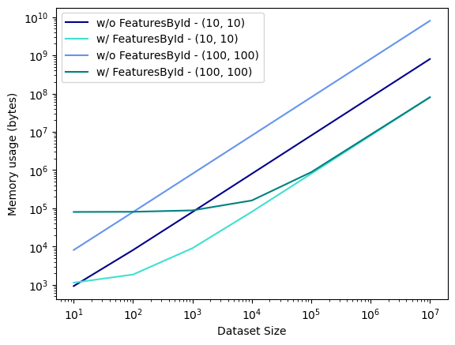
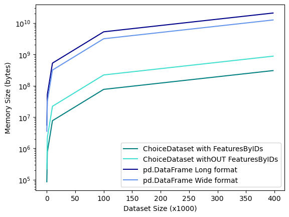

# Introduction

Discrete choice models aim to explain or predict choices made by individuals from a set of alternatives, i.e. an assortment. Well known use-cases include analyzing a commuter's choice of transportation mode or modelling in-stores or online products purchases. A key feature of choice models is their ability to handle varying assortments, where some alternatives may be unavailable for the choice maker. Choice models are often used to estimate interpretable coefficients of consumer's utility function such as a own - or cross - price elasticities. Another practical usage is to plug a fitted choice model into an optimization process, in order to inform operational decisions. For example, assortment optimization or pricing can be formulated as linear programming optimization problems for certain classical parametric choice models. While traditional specifications of choice models are restricted to a linear form, recent advances based on Machine-Learning algorithms call for the use of more complex models that can be fitted to larger datasets.

`Choice-Learn` provides a scalable and modular suite of choice modelling tools for practitioners and academic researchers. In order to offer a high flexibility while keeping a simple signature, the package is organized around two levels of interaction. The higher-level API allows a fast integration of choice datasets, and the specification and estimation of standard logit-based choice models. The lower level API offers capabilities to optimize memory usage or customize model formulations. `Choice-Learn` focuses on three main features that complement and extend existing:

- *Large-scale datasets*: optimized RAM usage and batching processes for very large-scale datasets
- *Model family*: Handling both parametric families of choice models and Machine Learning-based formulations within the same codebase
- *Tools*: to estimate, deploy, evaluate and use choice models


This tryptich, data, model and usage, is illustrated on \autoref{fig:generalorg} with examples of the two levels of API interactions.

# Statement of need

## Handling Large Datasets
Choice modelling is a natural tool for retailers or marketplaces to understand their customer base and to improve or optimize their commercial offering or operational footprint. With the fast-paced improvement of companies data architectures, larger and more reliable customer-level datasets have emerged. While several efficient Python packages have been made available to estimate choice models [@Bierlaire:2023; @Brathwaite:2018] they are usually not built to work with large-scale datasets.


`Choice-Learn`'s ChoiceDataset is built specifically to handle large choice datasets. It mainly relies on NumPy [@Harris:2020] with the objective to limit the memory footprint of the dataset. The key idea is to minimize features repetition and to rebuild the full data structure only for batches of the dataset.

- *Features splitting:* We define 'items_features' that describe each available alternative and 'shared_features' that are common to all alternatives for one given choice. These shared features usually change from one choice to another and can represent customer attributes for example. This split let us avoid repeating these 'shared_features' for each alternative as it would be implied by the standard "long format" of the input dataset.

- *Features by IDs:* Features can be stored in specific objects which are only referenced in the dataset by their ID. These features are stacked with the main dataset only in batches, when the data is processed. It is particularly efficient for features that are repeated in the dataset. Consider the case where we have a few different stores represented by their surface, position, etc... Such features are static - they never change. Therefore, they can be stored in an object and it suffices to reference the store where the choice observation occurs in the input dataset. Then, when a batch of data is retrieved, the full features matrix is generated from the ID. \autoref{fig:fbi} illustrates this approach.

## Parametrized and Machine-Learning based models
> Naming still unsatisfactory imo (Parametrized/Interpretable vs ?)

The availability of detailed customer choice data enables estimating more complex choice models. Recent research outlines this possibility with neural networks approaches [@Han:2022; @Aouad:2023] or tree-based boosting models [@Salvadé:2024; &@AouadMarket:2023].
The existing libraries [@Bierlaire:2023; @Brathwaite:2018; @Du:2023] are often not designed to integrate such machine learning-based approaches.

`Choice-Learn` proposes a model object structure and a unified estimation tools using automatic differentiation library which can flexibly accommodate parametric models such as the Conditional Logit [@Train:1987] as well as machine learning-based such as RUMnet [@Aouad:2023] or TasteNet [@Han:2022]. Specifically, we rely on the Tensorflow library [@Abadi:2015] implementing efficiently optimization algorithms such as LBFGS[@Nocedal:2006] and various gradient-descent optimizers [@Tieleman:2012; @Kingma:2017]. It also enables GPUs usage for parameters estimation that can prove to be time saving on high-dimensional or large-sample datasets.
Moreover, `Choice-Learn` also enables building new and custom choice models with a common inheritance scheme that minimizes user's integration effort. Compared to standard implementations there is virtually no restriction in specifying the utility function, as long as its gradient can be computed.
Finally, the TensorFlow backbone ensures an efficient use of the models in a production environment. Many state-of-the-art tools are provided for TensorFlow based models deployment and serving such as TFLite and TFServing.

## Beyond choice modeling: Assortment and pricing optimization

`Choice-Learn` also ambitions to offer a set of tools revolving around choice modelling. Assortment optimization is a common usecase that leverages a choice model in order to determine or design the optimal subset of alternative to offer customers in order to maximize a certain objective function. Examples includes assortment planning, display location optimization, and pricing. A generic implemenation is proposed in the library so that estimated choice models are easily plugged into such optimization processes.

# Examples

## RAM usage comparison

{ width=50% }

{ width=50% }

We provide numerical examples of memory usage to showcase the efficiency of Features by IDs provided by `Choice-Learn`. We consider a case where we have a feature repeated in a dataset. For instance, this may represent a one-hot encoding for locations, identified by a matrix of shape (n_locations, n_locations). Each row of the dataset of size dataset_size refers to one of the locations. In \autoref{fig:ram_usage}, we compare the memory usage for different dataset sizes and n_locations=10 and 100. We find that `Choice-Learn` can save several orders of magnitude of bytes in memory usage.

We conduct another experiment on the ICDM 2013 Expedia dataset [@Expedia:2013]. We compare four data handling methods: pandas.DataFrames in long and wide format that are commonly used in choice modelling packages, and `Choice-Learn`'s ChoiceDataset with and without Features by IDs. Following [@Aouad:2023] preprocessing of the dataset, four features are represented as one-hot values and are optimized with `Choice-Learn` data management.The results obtained by varying the sample size are reported in \autoref{fig:exp_ram_usage}.

## Choice model customization

Choice models following the Random Utility principle define the utility of an alternative $i \in \mathcal{A}$ as the sum of a deterministic part $U_i$ and an error random term $\epsilon_i$. If $\epsilon_i$ is supposed to be i.i.d. over all the available alternatives and following a Gumbel distribution, the probability to choose $i$ can be written as the softmax normalization over the available alternatives $j\in \mathcal{A}$:

$$\mathbb{P}(i) = \frac{e^{U_i}}{\sum_j e^{U_j}}$$\


### An example: Definition of non linear utility function
> What would be a better example ?

Most choice modelling packages only handle linear formulation of the utility. `Choice-Learn` allows flexibility and an easy creation of a custom choice model. Inheriting the ChoiceModel class lets the user define its own utility function. One only needs to sepcify how to compute the utility of a batch of data using elementary TensorFlow operations. Here is an example where we use the following formulation of utility for an alternative $i$ with features $x_i$ considered by a customer with features $z$:

$$U_i = \beta_l \cdot (elu(\Gamma_x \cdot x_i) + elu(\Gamma_z \cdot z)) $$
with $\Gamma_x$, $\Gamma_z$ matrixes and $\beta_l$ a vector to be estimated,
$elu$ is the activation function so that $elu(x) = x$ if $x > 0$ and $elu(x) = e^x-1$ if $x < 0$.

Below is an example of implementation using TensorFlow's Dense layers and `Choice-Learn`:

```python
from tensorflow.keras.layers import Dense
from choice_learn.models import ChoiceModel

class ExampleCustomizedModel(ChoiceModel):
    def __init__(self, n_neurons, **kwargs):
        super().__init__(**kwargs)
        self.n_neurons = n_neurons

        # Items Features Layer
        self.dense_items = Dense(units=n_neurons, activation="elu")

        # Shared Features Layer
        self.dense_shared = Dense(units=n_neurons, activation="elu")

        # Third layer: embeddings to utility (dense representation of features > U)
        self.final_layer = Dense(units=1, activation="linear")

    @property
    def trainable_weights(self):
        """Access model's trainable_weights.

        Returns
        -------
        list
            list of trainable_weights
        """
        return model.dense_items.trainable_variables\
              + model.dense_shared.trainable_variables\
                  + model.final_layer.trainable_variables

    def compute_batch_utility(self,
                              shared_features_by_choice,
                              items_features_by_choice,
                              available_items_by_choice,
                              choices):
        """Compute batch utility from features."""
        _, _ = available_items_by_choice, choices
        # We apply the neural network to all items_features_by_choice for all the items
        # We then concatenate the utilities of each item of shape (n_choices, 1) into
        # a single one of shape (n_choices, n_items)
        shared_embeddings = self.dense_shared(shared_features_by_choice[0])

        # Iterate over items
        items_features_embeddings = []
        for i in range(items_features_by_choice[0].shape[1]):
            # Utility is Dense(embeddings sum)
            item_embedding = shared_embeddings + self.dense_items(items_features_by_choice[0][:, i])
            items_features_embeddings.append(self.final_layer(item_embedding))

        # Concatenation to get right shape (n_choices, n_items, )
        item_utility_by_choice = tf.concat(items_features_embeddings, axis=1)

        return item_utility_by_choice
```

# Acknowledgements

# References
