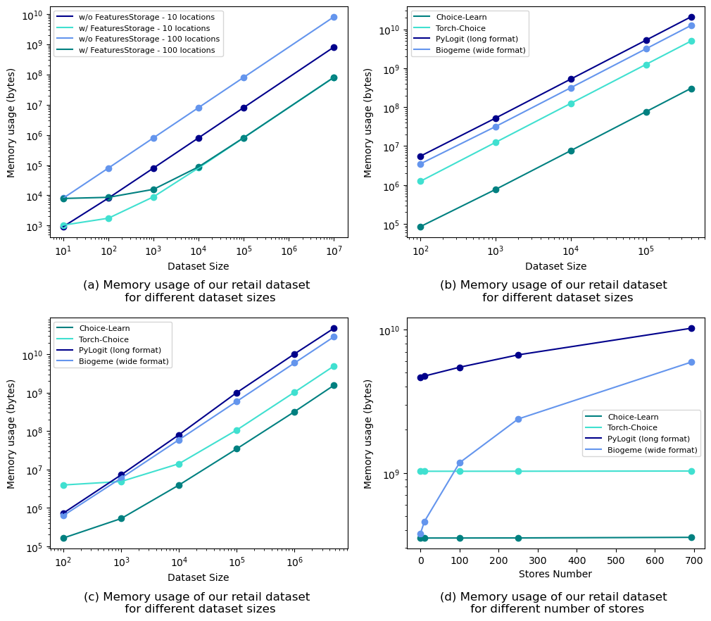

# Introduction

Discrete choice models aim at predicting choice decisions made by individuals from a menu of alternatives, which is known as an assortment. Well-known use cases include predicting a commuter's choice of transportation mode or a customer's purchases. A key capability of choice models is their ability to handle assortment variations, such as predicting choices when some alternatives become unavailable or when their features change in different operational contexts. This adaptability to different scenarios allows these models to be used as inputs for optimization problems, including assortment planning or pricing.

Choice-Learn provides a modular suite of choice modeling tools for practitioners and academic researchers to process choice data, and then formulate, estimate and operationalize choice models. The library is structured into two levels of usage, as illustrated in Figure \ref{fig:gen_org}. The higher-level is designed for fast and easy implementation and the lower-level enables more advanced parameterizations. This structure is inspired by Keras' different endpoints [@Chollet:2015], which enables a user-friendly modeling interface. Choice-Learn is designed with the following objectives:

- **Streamlined:** The processing of datasets and the estimation of standard choice models are facilitated by a simple code signature.
- **Scalable:** Optimized processes are implemented for data storage and models estimation, allowing the use of large datasets and models with a large number of parameters.
- **Flexible:** The codebase can be customized to fit different use cases.
- **Models Library:** The same package provides implementations of both standard choice models and machine learning-based methods, including neural networks.
- **Downstream operations:** Post-processing tools that leverage choice models for assortment planning and pricing are integrated into the library.


A summary of the main contributions is provided in Table \label{tab:comparison1} and \label{tab:comparison2}.

: Comparison of the different packages for data handling and downstream opereations.\label{tab:comparison1}

+--------------+------------------+--------------------+--------------+----------------+
|              | Data             |  Data              |              |                |
| Package      | Format           |  Batching          | Assortment   | Pricing        |
+:============:+:================:+:==================:+:============:+:==============:+
| Biogeme      | wide             | $\times$           |   $\times$   |   $\times$     |
+--------------+------------------+--------------------+--------------+----------------+
| PyLogit      | long             |  $\times$          |   $\times$   |   $\times$     |
+--------------+------------------+--------------------+--------------+----------------+
| Torch-Choice | Multi Index      | $\checkmark$       |   $\times$   |   $\times$     |
+--------------+------------------+--------------------+--------------+----------------+
| Choice-Learn | Features Storage | $\checkmark$       | $\checkmark$ | $\checkmark$   |
+==============+==================+====================+==============+================+


: Comparison of the different packages for modelization. CondL, NestL, MixL, and LatC respectively indicate the Conditional Logit, Nested Logit, Mixed Logit and Latent Class models.\label{tab:comparison2}

+--------------+---------------------------------+--------------------+----------------+----------------+----------------------+
|   Package    | Traditional\                    | Neural\            | Custom         | Non-Stochastic |  Stochastic          |
|              | Model                           | Net\               | Model          | Optimizer      |  Optimizer           |
|              |                                 | Model              |                |                |                      |
+:============:+:===============================:+:==================:+:==============:+:==============:+:====================:+
| Biogeme      | CondL, NestL,\                  | $\times$           | $\checkmark$   | Newton BFGS    | $\quad \times \quad$ |
|              | MixL, LatC\                     |                    |                |                |                      |
|              | & more                          |                    |                |                |                      |
+--------------+---------------------------------+--------------------+----------------+----------------+----------------------+
| PyLogit      | CondL, NestL,\                  |  $\times$          | $\times$       | BFGS           |   $\times$           |
|              | MixL,\                          |                    |                |                |                      |
|              | Asymmetric                      |                    |                |                |                      |
+--------------+---------------------------------+--------------------+----------------+----------------+----------------------+
| Torch-Choice | CondL, NestL                    | $\times$           | $\times$       | L-BFGS         | $\checkmark$         |
+--------------+---------------------------------+--------------------+----------------+----------------+----------------------+
| Choice-Learn | CondL, NestL,\                  | $\checkmark$       | $\checkmark$   | L-BFGS         | $\checkmark$         |
|              | LatC                            |                    |                |                |                      |
+==============+=================================+====================+================+================+======================+

# Statement of need

## Streamlined signatures
`Choice-Learn` proposes short code signatures. The *ChoiceDataset* object, which handles the data, takes only 4 inputs: 'items_features' describing each available alternative, 'shared_features' describing the context of the choice, 'available_items' indicating the subset of alternatives offered in the assortment, and finally 'choices', the chosen alternative. Methods to seamlessly integrate popular data formats, such as long and wide format dataframes [@Helveston:2023] are also provided.

```python
dataset = ChoiceDataset(choices, shared_features, items_features, available_items)
```

Finally, data usage, model estimation and evaluation are designed to be consistent with mainstream machine learning packages such as scikit-learn [@Pedregosa:2011].

## Data and model scalability

Choice modeling is widely used in retail and e-commerce sectors to better understand customer behavior and optimize product offerings. With the continuous development of firms' data architectures, larger-scale choice datasets are often available and valuable for managing customer-facing operations.

`Choice-Learn`'s data management relies on NumPy [@Harris:2020] with the objective of limiting the memory footprint. It minimizes the repetition of items or customers features and defers the jointure of the full data structure until processing batches of data. Moreover, the *FeaturesStorage* object, illustrated in Figure \ref{fig:fbi}, allows feature values to be referenced only by their ID. These feature values are substituted to the ID placeholder on the fly in the batching process. For instance, supermarkets features such as surface, position, or number of employees are often stationary. Thus, they can be stored in an auxiliary data structure and in the main dataset, the store where the choice is recorded is only referenced with its ID.

The package stands on Tensorflow [@Abadi:2015] for model estimation, offering the possibility to use fast second-order optimization algorithm such as L-BFGS [@Nocedal:2006] as well as various gradient-descent optimizers [@Tieleman:2012; @Kingma:2017] specialized in handling batches of data. GPU usage is also possible, which can prove to be time-saving.
Finally, the TensorFlow backbone ensures an efficient usage in a production environment, for instance within an assortment recommendation software, through deployment and serving tools, such as TFLite and TFServing.


## Flexible usage: From linear utility to customized specification

Choice models following the *Random Utility Maximization* principle [@McFadden:2000] define the utility of an alternative $i \in \mathcal{A}$ as the sum of a deterministic part $U(i)$ and a random error $\epsilon_i$. If the terms $(\epsilon_i)_{i \in \mathcal{A}}$ are assumed to be independent and Gumbel-distributed, the probability to choose alternative $i$ can be written as the softmax normalization over the available alternatives $j\in \mathcal{A}$:

$$\mathbb{P}(i|\mathcal{A}) = \frac{e^{U(i)}}{\sum_{j \in \mathcal{A}} e^{U(j)}}$$

The choice-modeler's job is to formulate an adequate utility function $U(.)$ depending on the context. In `Choice-Learn`, the user can parametrize predefined models or freely specify a custom utility function by overriding the *compute_batch_utility* method from the *ChoiceModel* class.

## Library of traditional random utility models and machine learning-based models

Traditional parametric choice models, including the Conditional Logit [@Train:1987], often specify the utility function in a linear form. This provides interpretable coefficients, such as price  elasticities, but also limits the predictive power of the model.
The availability of detailed customer choice data, paired with advances in machine learning, enables the estimation of more complex models, with neural networks approaches [@Han:2022; @Aouad:2023] and tree-based models [@Salvadé:2024; @AouadMarket:2023]. While existing choice libraries [@Bierlaire:2023; @Brathwaite:2018; @Du:2023] are often not designed to integrate such machine learning-based approaches, `Choice-Learn` proposes a collection including both types of models.

## Downstream operations: Assortment and pricing optimization
`Choice-Learn` also offers additional tools for downstream operations, that are not usually integrated in choice modeling libraries. In particular, assortment optimization is a common use case that leverages a choice model in order to determine the optimal subset of alternatives to offer customers in order to maximize a certain objective, such as the expected revenue, conversion rate, or social welfare. This framework captures a variety of applications such as assortment planning, display location optimization, and pricing. We provide a generic implementation based on the mixed-integer programming formulation described in [@MendezDiaz:2014], with the option to choose the solver between Gurobi [@Gurobi:2023] and OR-Tools [@ORTools:2024].


# Experiments and examples

## Memory usage: a case study

We provide numerical examples of memory usage to showcase the efficiency of the *FeaturesStorage*. Consider a feature repeated in a dataset, such as a one-hot encoding for locations, represented by a matrix of shape (*#locations, #locations*) where each row refers to one location. In Figure \ref{fig:xps} (a), we compare the memory usage for different dataset sizes.

We conduct a similar comparison on the ICDM 2013 Expedia dataset [@Expedia:2013] with four data handling methods: pandas.DataFrames [@pandas:2020] in long and wide format, both used in choice modeling packages, as well as Torch-Choice and `Choice-Learn`. Figure \ref{fig:xps} (b) shows the results for various sample sizes.

Finally, in Figure \ref{fig:xps} (c) and (d), we observe performance gains in terms of memory management on a proprietary dataset in brick-and-mortar retailing consisting of the aggregation of more than 4 million purchases over 5 years in Konzum supermarkets in Croatia. Focusing  on the *coffee* subcategory, the dataset specifies, for each purchase, which products were available, their prices, as well as a one-hot representation of the supermarket.



## Customized choice models
We provide an example of the custom model definition with the following formulation of utility $U(i)$ with alternative features $x_i$ and customer features $z$:
$$U(x_i, z) = \beta_l \cdot \sigma(\sigma(\Gamma_x \cdot x_i) + \sigma(\Gamma_z \cdot z)) + \epsilon_i,$$
where $\Gamma_x$, $\Gamma_z$ are matrices and $\beta_l$ is a vector, all three to be estimated and $\sigma$ being the sigmoid activation function.
To declare a custom model, one needs to inherit the *ChoiceModel* class and overwrite the `compute_batch_utility` method.


```python
    def __init__(self, n_neurons, **kwargs):
        super().__init__(**kwargs)

        self.gamma_x = Dense(units=n_neurons, activation="sigmoid")
        self.gamma_z = Dense(units=n_neurons, activation="sigmoid")
        self.beta_l = Dense(units=1, activation="linear")

    def compute_batch_utility(self,
                              shared_features_by_choice,
                              items_features_by_choice,
                              **kwargs):

        z_embedding = self.gamma_z(shared_features_by_choice)

        item_utility_by_choice = []
        for i in range(n_items):
            embedding = sigmoid(shared_embeddings +\
            self.gamma_w(items_features_by_choice[:, i]))
            item_utility_by_choice.append(self.beta_l(item_embedding))

        item_utility_by_choice = tf.concat(item_utility_by_choice, axis=1)

        return item_utility_by_choice
```

# Acknowledgments
The authors thank Fortenova[^1] and Martin Možina for their helpful collaboration and providing of the proprietary dataset.

# References

[^1]: https://fortenova.hr/en/home/
