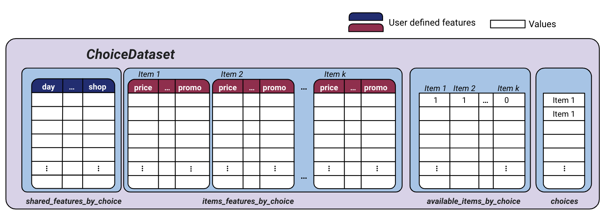

# Summary

Discrete choice models aim at explaining or predicting a choice from a set of alternatives. Well known use-cases include analyzing people choice of mean of transport or products purchases in stores. One key attribute of choice models is their ability to handle sets of variable sizes, with some alternatives being possibly unavailable. Choice models can be used to estimate interpretable values such as a consumer's price elasticity. Once estimated, they can also be used in second processing step such as assortment optimization or pricing. Recent outbreaks in the Machine-Learning community calls for the use of more complex models and larger datasets in the estimation of choice models.

`Choice-Learn` provides useful tools for academic researchs as well as practioners. In particular, the package focuses on three main points to extend choice modelling tools:
- Handling paramtric and non-parametric, such Machine-Learning based, choice models within the same codebase
- Making possible to work with very large datasets with RAM usage optimization and batching processes
- Providing common tools for choice models use

# Statement of need

## Large Datasets

With the fast-paced improvement of companies data architectures, larger reliable datasets emerge. Choice modelling is a natural tool for a retailer to understand its customer base and to improve or optimize its commercial offer. While several efficient Python packages have been made available to estimate choice models [@Bierlaire:2023; @Brathwaite:2018] they are usually not built to work with large-scale datasets.

Choice-Learn's ChoiceDataset is built specifically to handle choice data. It mainly relies on NumPy [@Harris:2020] with the objective to limit the memory footprint of the dataset. The key idea is to limit features repetition and to rebuild the full data structure only for batches of the dataset.
- Features splitting: We define 'items_features' that describe each alternative among which to choose and 'fixed_features' that are shared by all alternatives for one given choice. The fixed_features usually change from one choice to another and can represent customer features for example. Its functioning is illustrated on Figure \autoref{fig:dataset}.
- Features by ID: We allow to store features in specific object and to reference it only by its ID in the dataset. These features are stacked with the others only by batches. It is particularly efficient for features that are repeated in the datasets. A usual example can be the one-hot representations of the place where the choice happens. It is illustrated on Figure \autoref{fig:fbi}.



## Parametric and non-parametric models

The large datasets now available open the door for the use of more complex machine learning models that can otherwise be difficult to estimate with little data. Recent publications outlines this possibility with neural networks approaches [@Han:2022; @Aouad:2023] or tree-based boosting models [@Salvadé:2024].
The existing libraries [@Bierlaire:2023; @Brathwaite:2018; @Du:2023] are usually not built to integrate such non-linear approaches.

Choice-Learn's proposes a model structure that integrates parametric models such as the Conditional-MNL [@Train:1987] as well as non-paramtric ones like RUMnet [@Aouad:2023]. It is based on Tensorflow [@Abadi:2015] using already existing efficient implementation of optimization algorithms such as LBFGS[] or different version of the gradient descent[]. It also enables optimization using GPUs that can prove to be particularly time saving.
Moreover, Choice-Learn also aims at helping for building new and custom choice models with a common inheritance scheme that minimizes the user's work. Compared to usual implementations non linear formulations of utility are possible, as long as it is possible to define it with derivable Tensorflow operations.

## Tools for choice modelling

Choice-Learn ambitions to propose a set of tools revolving around choice modelling such as an assortment optimizer. Assortment optimization is a common usecase that uses a choice model as an input to fing which subset of alternative is the most optimal with regards to a metric. Generic implemenations are proposed so that estimated choice models are easily plugged into such optimization processes.

# Examples

Choice models following the Random Utility principle define the utility of an alternative $i \in \mathcal{A}$ as the sum of a deterministic part $U_i$ and an error random term $\epsilon_i$. If $\epsilon$ is supposed to be i.i.d. over all the available alternative and following a Gumbel distribution, the probability function can be written as the softmaw normalization over the alternatives $j\in \mathcal{A}$:

$$\mathbb{P}(i) = \frac{e^{U_i}}{\sum_j e^{U_j}}$$

## Choice model customization

Most choice modelling packages only handle linear formulation of the utility. Choice-Learn allows flexibility and an easy creation of a custom choice model. Inheriting the ChoiceModel class lets the user define its own choice model. One only needs to precise how to compute the utility of a batch of data using TensorFlow operations. Here is an example.
### Check example > What would be a great example ?

```python
from tensorflow.keras.layers import Dense
from choice_learn.models import ChoiceModel

class ExampleCustomizedModel(ChoiceModel):
    def __init__(self, **kwargs):
        super().__init__(**kwargs)
        # First non-linear layer
        self.dense_1 = Dense(units=10, activation="elu")
        # Second linear layer
        self.dense_2 = Dense(units=1, activation="linear")
        # We do not forget to specify self.weights with all coefficients that need to be estimated.
        # Easy with TensorFlow.Layer
        self.weights = self.dense_1.trainable_variables + self.dense_2.trainable_variables

    def compute_batch_utility(self,
                        fixed_items_features,
                        contexts_features,
                        contexts_items_features,
                        contexts_items_availabilities,
                        choices):
        # We apply the neural network to all sessions_items_features for all the items
        # We then concatenate the utilities of each item of shape (n_sessions, 1) into a single one of shape (n_sessions, n_items)
        u = tf.concat([self.dense_2(self.dense_1(contexts_items_features[0][:, i])) for i in range(contexts_items_features[0].shape[1])], axis=1)
        return u
```

# Acknowledgements

# References
