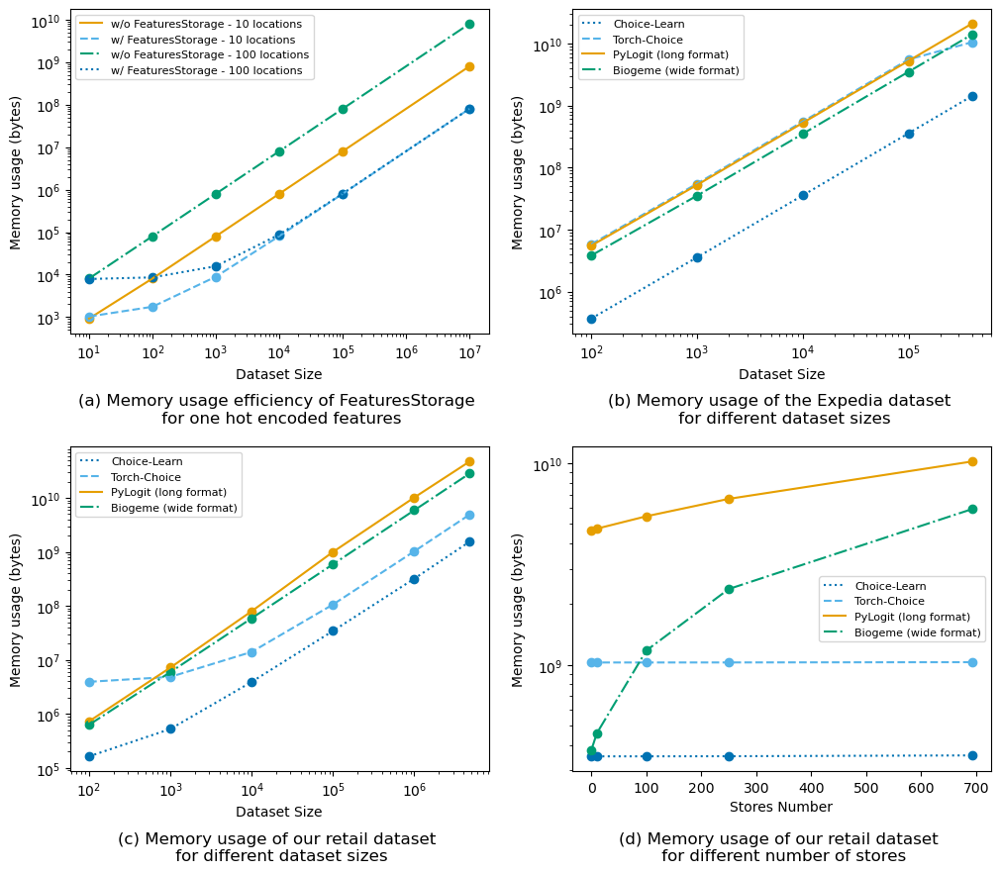

# Introduction

Discrete choice models aim at predicting choice decisions made by individuals from a menu of alternatives, called an assortment. Well-known use cases include predicting a commuter's choice of transportation mode or a customer's purchases. Choice models are able to handle assortment variations, when some alternatives become unavailable or when their features change in different contexts. This adaptability to different scenarios allows these models to be used as inputs for optimization problems, including assortment planning or pricing.

Choice-Learn provides a modular suite of choice modeling tools for practitioners and academic researchers to process choice data, and then formulate, estimate and operationalize choice models. The library is structured into two levels of usage, as illustrated in Figure \ref{fig:gen_org}. The higher-level is designed for fast and easy implementation and the lower-level enables more advanced parameterizations. This structure, inspired by Keras' different endpoints [@Chollet:2015], enables a user-friendly interface. Choice-Learn is designed with the following objectives:

- **Streamlined:** The processing of datasets and the estimation of standard choice models are facilitated by a simple code signature that are consistent with mainstream machine learning packages such as scikit-learn [@Pedregosa:2011].
- **Scalable:** Optimized processes are implemented for data storage and models estimation, allowing the use of large datasets and models with a large number of parameters.
- **Flexible:** The codebase can be customized to fit different use cases.
- **Models Library:** The same package provides implementations of both standard choice models and machine learning-based methods, including neural networks.
- **Downstream operations:** Post-processing tools that leverage choice models for assortment planning and pricing are integrated into the library.

The main contributions are summarized in Tables \ref{tab:comparison1} and \ref{tab:comparison2}.

: Comparison of the different packages for data handling and downstream opereations.\label{tab:comparison1}

| Package      | Data Format      |  Data Batching     | Assortment   | Pricing        |
| :----------: | :--------------: | :----------------: | :----------: | :------------: |
| Biogeme      | wide             | $\times$           | $\times$     | $\times$       |
| PyLogit      | long             | $\times$           | $\times$     | $\times$       |
| Torch-Choice | Multi Index      | $\checkmark$       | $\times$     | $\times$       |
| Choice-Learn | Features Storage | $\checkmark$       | $\checkmark$ | $\checkmark$   |

: Comparison of the different packages for modelization. CondL, NestL, MixL, and LatC respectively indicate the Conditional Logit, Nested Logit, Mixed Logit and Latent Class models.\label{tab:comparison2}

|   Package    | Traditional Models              | NeuralNet Models   | Custom Models  | Non-Stochastic Optimizer | Stochastic Optimizer |
| :----------: | :-----------------------------: | :----------------: | :------------: | :----------------------: | :------------------: |
| Biogeme      | CondL, NestL,MixL, LatC & more  | $\times$           | $\checkmark$   | Newton BFGS              | $\quad \times \quad$ |
| PyLogit      | CondL, NestL,MixL, Asymmetric   | $\times$           | $\times$       | BFGS                     | $\times$             |
| Torch-Choice | CondL, NestL                    | $\times$           | $\times$       | L-BFGS                   | $\checkmark$         |
| Choice-Learn | CondL, NestL, LatC              | $\checkmark$       | $\checkmark$   | L-BFGS                   | $\checkmark$         |

# Statement of need

## Data and model scalability

`Choice-Learn`'s data management relies on NumPy [@Harris:2020] with the objective of limiting the memory footprint. It minimizes the repetition of items or customers features and defers the jointure of the full data structure until processing batches of data. The package introduces the *FeaturesStorage* object, illustrated in Figure \ref{fig:fbi}, that allows feature values to be referenced only by their ID. These values are substituted to the ID placeholder on the fly in the batching process. For instance, supermarkets features such as surface or position are often stationary. Thus, they can be stored in an auxiliary data structure and in the main dataset, the store where the choice is recorded is only referenced with its ID.

The package stands on Tensorflow [@Abadi:2015] for model estimation, offering the possibility to use fast quasi-Newton optimization algorithm such as L-BFGS [@Nocedal:2006] as well as various gradient-descent optimizers [@Tieleman:2012; @Kingma:2017] specialized in handling batches of data. GPU usage is also possible, which can prove to be time-saving.
Finally, the TensorFlow backbone ensures an efficient usage in a production environment, for instance within an assortment recommendation software, through deployment and serving tools, such as TFLite and TFServing.

## Flexible usage: From linear utility to customized specification

Choice models following the *Random Utility Maximization* principle [@McFadden:2000] define the utility of an alternative $i \in \mathcal{A}$ as the sum of a deterministic part $U(i)$ and a random error $\epsilon_i$. If the terms $(\epsilon_i)_{i \in \mathcal{A}}$ are assumed to be independent and Gumbel-distributed, the probability to choose alternative $i$ can be written as the softmax normalization over the available alternatives $j\in \mathcal{A}$:

$$\mathbb{P}(i|\mathcal{A}) = \frac{e^{U(i)}}{\sum_{j \in \mathcal{A}} e^{U(j)}}$$

The choice-modeler's job is to formulate an adequate utility function $U(.)$ depending on the context. In `Choice-Learn`, the user can parametrize predefined models or freely specify a custom utility function.
To declare a custom model, one needs to inherit the *ChoiceModel* class and overwrite the `compute_batch_utility` method as shown in the [documentation](https://artefactory.github.io/choice-learn/).

## Library of traditional random utility models and machine learning-based models

Traditional parametric choice models, including the Conditional Logit [@Train:1987], often specify the utility function in a linear form. This provides interpretable coefficients but limits the predictive power of the model.
Recent works propose the estimation of more complex models, with neural networks approaches [@Han:2022; @Aouad:2023] and tree-based models [@Salvadé:2024; @AouadMarket:2023]. While existing choice libraries [@Bierlaire:2023; @Brathwaite:2018; @Du:2023] are often not designed to integrate such machine learning-based approaches, `Choice-Learn` proposes a collection including both types of models.

## Downstream operations: Assortment and pricing optimization
`Choice-Learn` offers additional tools for downstream operations, that are not usually integrated in choice modeling libraries. In particular, assortment optimization is a common use case that leverages a choice model to determine the optimal subset of alternatives to offer customers maximizing a certain objective, such as the expected revenue, conversion rate, or social welfare. This framework captures a variety of applications such as assortment planning, display location optimization, and pricing. We provide implementations based on the mixed-integer programming formulation described in [@MendezDiaz:2014], with the option to choose the solver between Gurobi [@Gurobi:2023] and OR-Tools [@ORTools:2024].

# Memory usage: a case study

We provide in Figure \ref{fig:xps} (a) numerical examples of memory usage to showcase the efficiency of the *FeaturesStorage*. We consider a feature repeated in a dataset, such as a one-hot encoding for locations, represented by a matrix of shape (*#locations, #locations*) where each row refers to one location.

We compare four data handling methods on the Expedia dataset [@Expedia:2013]: pandas.DataFrames [@pandas:2020] in long and wide format, both used in choice modeling packages, Torch-Choice and `Choice-Learn`. Figure \ref{fig:xps} (b) shows the results for various sample sizes.

Finally, in Figure \ref{fig:xps} (c) and (d), we observe memory usage gains on a proprietary dataset in brick-and-mortar retailing consisting of the aggregation of more than 4 billion purchases in Konzum supermarkets in Croatia. Focusing on the *coffee* subcategory, the dataset specifies, for each purchase, which products were available, their prices, as well as a one-hot representation of the supermarket.

# Acknowledgments
The authors thank Fortenova[^1] and Martin Možina for their helpful collaboration and provision of the proprietary dataset.

# References

[^1]: https://fortenova.hr/en/home/
