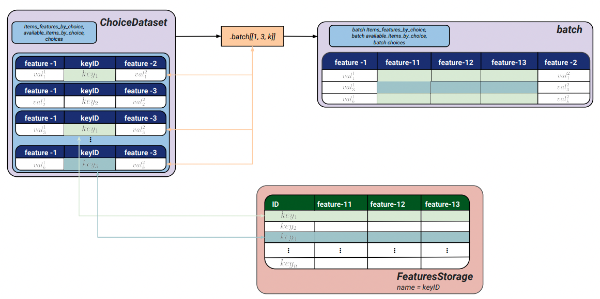

# Introduction

Discrete choice models aim at explaining or predicting a choice from a set of alternatives. Well known use-cases include analyzing a person's choice of transportation mode or modelling in-stores products purchases. One key attribute of choice models is their ability to handle sets of variable sizes, with some alternatives being potentially unavailable. Choice models are often used to estimate interpretable values such as a consumer's price elasticity or cross-effects. Other usages add a second processing step with a choice model as input. For example, assortment optimization or pricing can be formulated as linear programming optimization problems from a choice model's outputs. Usual formulations of choice models keep a linear form, however, recent outbreaks in the Machine-Learning community call for the use of more complex models with larger datasets.

`Choice-Learn` provides useful choice modelling tools for academic researchers as well as practioners. In order to offer a high flexibility while keeping a simple signature, the package is organized around two levels of interaction. The higher-level API allows a fast integration of any dataset and estimation of predefined models. The lower level API offers the possibility for better optimizations such as memory consumption and modelling customization. Choice-Learn focuses on three main features to extend existing choice modelling tools:
- Making possible to work with very large datasets with RAM usage optimization and batching processes
- Handling parametrized as well as Machine-Learning formulations of choice models within the same codebase
- Providing common tools for choice models usage


This tryptich, data, model and usage, is illustrated on Figure \autoref{fig:generalorg} with examples of the two levels of API interactions.

# Statement of need

## Handling Large Datasets
Choice modelling is a natural tool for retailers or marketplaces to understand their customer base and to improve or optimize their commercial offers. With the fast-paced improvement of companies data architectures, larger and more reliable datasets emerge. While several efficient Python packages have been made available to estimate choice models [@Bierlaire:2023; @Brathwaite:2018] they are usually not built to work with large-scale datasets.



Choice-Learn's ChoiceDataset is built specifically to handle large choice datasets. It mainly relies on NumPy [@Harris:2020] with the objective to limit the memory footprint of the dataset. The key idea is to minimize features repetition and to rebuild the full data structure only for batches of the dataset.
- Features splitting: We define 'items_features' that describe each alternative among which to choose and 'shared_features' that are common to all alternatives for one given choice. These shared features usually change from one choice to another and can represent customer attributes for example.
- Features by ID: We allow to store features in specific object and to reference it only by its ID in the dataset. These features are stacked with the others only by batches. It is particularly efficient for features that are repeated in the datasets. A usual example can be the one-hot representations of the place where the choice happens. The one hot representation is stored in a specific object and only a reference is kept in the choice dataset. On Figure \autoref{fig:fbi} an example of use is illustrated.

## Parametrized and Machine-Learning based models
> Naming still unsatisfactory imo (Parametrized/Interpretable vs ?)

The large datasets now available open the door for the use of more complex machine learning models that can otherwise be difficult to estimate with little data. Recent publications outlines this possibility with neural networks approaches [@Han:2022; @Aouad:2023] or tree-based boosting models [@Salvadé:2024].
The existing libraries [@Bierlaire:2023; @Brathwaite:2018; @Du:2023] are usually not built to integrate such non-linear approaches.

Choice-Learn's proposes a model structure that integrates parametrized models such as the Conditional-MNL [@Train:1987] as well as more complex ones like RUMnet [@Aouad:2023] or TasteNet [@Han:2022]. It is based on Tensorflow [@Abadi:2015] using already existing efficient implementation of optimization algorithms such as LBFGS[@Nocedal:2006] or different version of the gradient descent[@Tieleman:2012; @Kingma:2017]. It also enables GPUs usage for parameters estimation that can prove to be particularly time saving.
Moreover, Choice-Learn also aims at helping for building new and custom choice models with a common inheritance scheme that minimizes the user's work. Compared to usual implementations there are not limit to utility formulation, as long as it is possible to define a derivative function.
Finally, this TensorFlow backbone ensures an efficient use of the models in a production environment. Many state-of-the-art tools are provided for TensorFlow based models deployment and serving.

## Tools for choice modelling

Choice-Learn also ambitions to offer a set of tools revolving around choice modelling. Assortment optimization is a common usecase that uses a choice model in order to find which subset of alternatives is the most optimal with regards to a metric. A generic implemenation is proposed in the library so that estimated choice models are easily plugged into such optimization processes.

# Examples

## RAM usage comparison

{ width=60% } { width=60% }

We conduct a small study on datasets memory usage in order to showcase the efficiency of Features by IDs provided by Choice-Learn. We consider a case where we have a feature that repeats itself over the dataset. For example if we represent a location with one-hot encoding, the different locations can be represented by a matrix of shape (n_locations, n_locations) that are repeated over the dataset of size dataset_size. In the Figure \autoref{fig:ram_usage} we compare the memory usage for different dataset sizes and n_locations=10 and 100. It shows how Choice-learn can save several magnitude of memory usage.

We conduct another experiment on the real ICDM 2013 Expedia dataset [@Expedia:2013]. We compare four data handling methods: pandas.DataFrames in long and wide format that are commonly used in choice modelling packages, and Choice-Learn's ChoiceDataset with and without Features by IDs. Following [@Aouad:2023] preprocessing of the dataset, four features are represented as one-hot values and are optimized with Choice-Learn data management.

## Choice model customization

Choice models following the Random Utility principle define the utility of an alternative $i \in \mathcal{A}$ as the sum of a deterministic part $U_i$ and an error random term $\epsilon_i$. If $\epsilon$ is supposed to be i.i.d. over all the available alternative and following a Gumbel distribution, the probability function can be written as the softmax normalization over the available alternatives $j\in \mathcal{A}$:

$$\mathbb{P}(i) = \frac{e^{U_i}}{\sum_j e^{U_j}}$$


### An example: Definition of non linear utility function
> What would be a better example ?

Most choice modelling packages only handle linear formulation of the utility. Choice-Learn allows flexibility and an easy creation of a custom choice model. Inheriting the ChoiceModel class lets the user define its own choice model. One only needs to precise how to compute the utility of a batch of data using TensorFlow operations. Here is an example where we use the following formulation of utility for an alternative $i$ considered by a customer:

$$U_i = \beta_l \cdot (elu(\Gamma_x \cdot x_i) + elu(\Gamma_z \cdot z)) $$
with $x_i$ features describing the alternative $i$, $z$ features describing a customer and $\Gamma_x$, $\Gamma_z$ matrixes and $\beta_l$ a vector to be estimated.
elu is the function so that $elu(x) = x$ if $x > 0$ and $elu(x) = e^x-1$ if $x < 0$
Here is an example implementation using TensorFlow's Dense layers and Choice-Learn:

```python
from tensorflow.keras.layers import Dense
from choice_learn.models import ChoiceModel

class ExampleCustomizedModel(ChoiceModel):
    def __init__(self, n_neurons, **kwargs):
        super().__init__(**kwargs)
        self.n_neurons = n_neurons

        # Items Features Layer
        self.dense_items = Dense(units=n_neurons, activation="elu")

        # Shared Features Layer
        self.dense_shared = Dense(units=n_neurons, activation="elu")

        # Third layer: embeddings to utility (dense representation of features > U)
        self.final_layer = Dense(units=1, activation="linear")

    @property
    def trainable_weights(self):
        """Endpoint to acces model's trainable_weights.

        Returns:
        --------
        list
            list of trainable_weights
        """
        return model.dense_items.trainable_variables\
              + model.dense_shared.trainable_variables\
                  + model.final_layer.trainable_variables

    def compute_batch_utility(self,
                              shared_features_by_choice,
                              items_features_by_choice,
                              available_items_by_choice,
                              choices):
        """Computes batch utility from features."""
        _, _ = available_items_by_choice, choices
        # We apply the neural network to all items_features_by_choice for all the items
        # We then concatenate the utilities of each item of shape (n_choices, 1) into
        # a single one of shape (n_choices, n_items)
        shared_embeddings = self.dense_shared(shared_features_by_choice[0])

        # Iterate over items
        items_features_embeddings = []
        for i in range(items_features_by_choice[0].shape[1]):
            # Utility is Dense(embeddings sum)
            item_embedding = shared_embeddings + self.dense_items(items_features_by_choice[0][:, i])
            items_features_embeddings.append(self.final_layer(item_embedding))

        # Concatenation to get right shape (n_choices, n_items, )
        item_utility_by_choice = tf.concat(items_features_embeddings, axis=1)

        return item_utility_by_choice
```

# Acknowledgements

# References
