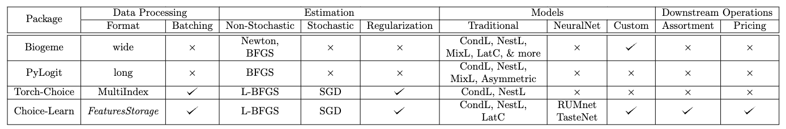

: Comparison of implemented sequence aggregation methods (average word error rate is used).\label{tab:sequence}
+--------------+-------------+--------------------+----------------+-----------+----------------+
| Package      | Data Processing                  | Estimation                                  |
+--------------+-------------+--------------------+----------------+-----------+----------------+
|              | Format      | Batching           | Non-stochastic | Stochastic| Regularization |
+:============:+:===========:+:==================:+:==============:+:=========:+:==============:+
| Biogeme      | wide        |     X              | Newton BFGS    |           |                |
+--------------+-------------+--------------------+----------------+-----------+----------------+
| PyLogit      | format      |     X              | BFGS           |           |                |
+--------------+-------------+--------------------+----------------+-----------+----------------+
| Torch-Choice |             | :white_check_mark: | L-BFGS         | - body    |                |
+--------------+-------------+--------------------+----------------+-----------+----------------+
| Choice-Learn |             | :white_check_mark: | L-BFGS         | - here    |                |
+==============+=============+====================+================+===========+================+
| Package      | Models                                            | Downstream Operations      |
+--------------+-------------+--------------------+----------------+-----------+----------------+
|              | Traditional |          NeuralNet |         Custom | Assortment|       Pricing  |
+:============:+:===========:+:==================:+:==============:+:=========:+:==============:+
| Biogeme      | cells span columns               | cells        span columns  |      columns   |
+--------------+-------------+--------------------+----------------+-----------+----------------+
| PyLogit      | cells span columns               | cells        span columns  | columns        |
+--------------+-------------+--------------------+----------------+-----------+----------------+
| Torch-Choice | cells span columns               | cells        span columns  |      columns   |
+--------------+-------------+--------------------+----------------+-----------+----------------+
| Choice-Learn | cells span columns               | cells  span       columns  | columns        |
+==============+=============+====================+================+===========+================+

+--------------+-------------+--------------------+----------------+-----------+----------------+
| Package      | Data Processing                  | Estimation                                  |
|              |-------------+--------------------+----------------+-----------+----------------+
|              | Format      | Batching           | Non-stochastic | Stochastic| Regularization |
+:============:+:===========:+:==================:+:==============:+:=========:+:==============:+
| Biogeme      | wide        |     X              | Newton BFGS    |           |                |
+--------------+-------------+--------------------+----------------+-----------+----------------+
| PyLogit      | format      |     X              | BFGS           |           |                |
+--------------+-------------+--------------------+----------------+-----------+----------------+
| Torch-Choice |             | :white_check_mark: | L-BFGS         | - body    |                |
+--------------+-------------+--------------------+----------------+-----------+----------------+
| Choice-Learn |             | :white_check_mark: | L-BFGS         | - here    |                |
+==============+=============+====================+================+===========+================+

+--------------+-------------+--------------------+----------------+-----------+----------------+
| Package      | Models                                            | Downstream Operations      |
|              +:===========:+:==================:+:==============:+:=========:+:==============:+
|              | Traditional |          NeuralNet |         Custom | Assortment|       Pricing  |
+:============:+:===========:+:==================:+:==============:+:=========:+:==============:+
| Biogeme      | cells span columns               | cells        span columns  |      columns   |
+--------------+-------------+--------------------+----------------+-----------+----------------+
| PyLogit      | cells span columns               | cells        span columns  | columns        |
+--------------+-------------+--------------------+----------------+-----------+----------------+
| Torch-Choice | cells span columns               | cells        span columns  |      columns   |
+--------------+-------------+--------------------+----------------+-----------+----------------+
| Choice-Learn | cells span columns               | cells  span       columns  | columns        |
+==============+=============+====================+================+===========+================+

+--------------+------------------+--------------------+----------------+--------------+----------------+
| Package      | Data Processing                       | Estimation                                     |
|--------------+------------------+--------------------+----------------+--------------+----------------+
|              | Format           | Batching           | Non-stochastic | Stochastic   | Regularization |
+:============:+:================:+:==================:+:==============:+:============:+:==============:+
| Biogeme      | wide             |     X              | Newton BFGS    |     X        |        X       |
+--------------+------------------+--------------------+----------------+--------------+----------------+
| PyLogit      | format           |     X              | BFGS           |     X        |       X        |
+--------------+------------------+--------------------+----------------+--------------+----------------+
| Torch-Choice | Multi Index      | $\checkmark$       | L-BFGS         | $\checkmark$ | $\checkmark$   |
+--------------+------------------+--------------------+----------------+--------------+----------------+
| Choice-Learn | Features Storage | $\checkmark$       | L-BFGS         | $\checkmark$ | $\checkmark$   |
+==============+==================+====================+================+==============+================+

+--------------+---------------------------------+--------------------+----------------+--------------+----------------+
| Package      | Models                                                                | Downstream Operations         |
|              +---------------------------------+--------------------+----------------+--------------+----------------+
|              | Traditional                     |          NeuralNet |         Custom | Assortment   |     Pricing    |
+:============:+:===============================:+:==================:+:==============:+:============:+:==============:+
| Biogeme      | CondL, NestL, MixL, LatC & more | $\times$           | $\checkmark$   |   $\times$   |   $\times$     |
+--------------+---------------------------------+--------------------+----------------+--------------+----------------+
| PyLogit      | CondL, NestL, MixL, Asymmetric  |  $\times$          | $\times$       |   $\times$   |   $\times$     |
+--------------+---------------------------------+--------------------+----------------+--------------+----------------+
| Torch-Choice | CondL, NestL                    | $\times$           | $\times$       |  $\times$    |   $\times$     |
+--------------+---------------------------------+--------------------+----------------+--------------+----------------+
| Choice-Learn | CondL, NestL, LatC              | $\checkmark$       | $\checkmark$   | $\checkmark$ | $\checkmark$   |
+==============+=================================+====================+================+==============+================+

: Comparison of \label{tab:tab2}
+---------------------------------+
|  |
+---------------------------------+

: Comparison of implemented sequence aggregation methods (average word error rate is used).\label{tab:comparison}

+--------------+------------------+--------------------+----------------+--------------+----------------+
| Package      | Format           |  Batching          | Non-Stochastic |  Stochastic  | Regularization |
+:============:+:================:+:==================:+:==============:+:============:+:==============:+
| Biogeme      | wide             | $\times$           | Newton BFGS    |   $\times$   |   $\times$     |
+--------------+------------------+--------------------+----------------+--------------+----------------+
| PyLogit      | long             |  $\times$          | BFGS           |   $\times$   |   $\times$     |
+--------------+------------------+--------------------+----------------+--------------+----------------+
| Torch-Choice | Multi Index      | $\checkmark$       | L-BFGS         | $\checkmark$ | $\checkmark$   |
+--------------+------------------+--------------------+----------------+--------------+----------------+
| Choice-Learn | Features Storage | $\checkmark$       | L-BFGS         | $\checkmark$ | $\checkmark$   |
+==============+==================+====================+================+==============+================+

+--------------+---------------------------------+--------------------+----------------+--------------+----------------+
|   Package    | Traditional                     | NeuralNet          | Custom         | Assortment   | Pricing        |
+:============:+:===============================:+:==================:+:==============:+:============:+:==============:+
| Biogeme      | CondL, NestL, MixL, LatC & more | $\times$           | $\checkmark$   |   $\times$   |   $\times$     |
+--------------+---------------------------------+--------------------+----------------+--------------+----------------+
| PyLogit      | CondL, NestL, MixL, Asymmetric  |  $\times$          | $\times$       |   $\times$   |   $\times$     |
+--------------+---------------------------------+--------------------+----------------+--------------+----------------+
| Torch-Choice | CondL, NestL                    | $\times$           | $\times$       |  $\times$    |   $\times$     |
+--------------+---------------------------------+--------------------+----------------+--------------+----------------+
| Choice-Learn | CondL, NestL, LatC              | $\checkmark$       | $\checkmark$   | $\checkmark$ | $\checkmark$   |
+==============+=================================+====================+================+==============+================+
